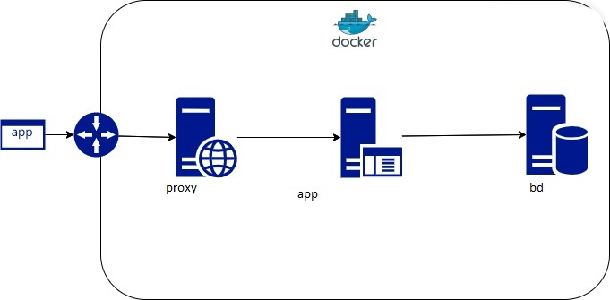

# Desafio de Consulta de Posicionamento de Veículos

Este projeto é uma solução para o desafio de consulta de posicionamento de veículos, no qual o objetivo é fornecer um conjunto de APIs de backend para consulta de informações relacionadas a veículos e Pontos de Interesse (POIs).

# O Que Você Vai Entregar

## Requisitos Funcionais Obrigatórios

APIs de Backend para Consulta: As APIs de backend de consulta fornecerão informações detalhadas sobre o tempo que os veículos passaram dentro de cada Ponto de Interesse (POI) cadastrado. Isso permite que os usuários saibam quanto tempo cada veículo esteve em cada POI.

Integração com o FrontEnd: Essas APIs serão consumidas pelo FrontEnd, possibilitando que os dados sejam exibidos de forma resumida em uma tabela. Os usuários terão a capacidade de filtrar essas informações por data e/ou placa do veículo diretamente no FrontEnd. O backend entregará as informações filtradas para o FrontEnd, sem a necessidade de processamento adicional do lado do cliente.

APIs de Backend para Inserção de Dados: Além das APIs de consulta, o projeto também incluirá APIs de backend para a inserção de novos dados de posicionamento de veículos. Isso permite que novos dados referentes à tabela "Dados de Posição" (posicoes.csv) sejam adicionados à aplicação.

APIs de Backend para Inserção de Novos POIs: Para maior flexibilidade, as APIs também permitirão a inserção de novos Pontos de Interesse (POIs) semelhantes aos dados de posicionamento de veículos. Isso facilita a expansão da lista de POIs cadastrados pelo cliente.

Simplicidade na Autenticação: Como parte da abordagem de simplicidade, a aplicação não exigirá autenticação de usuário, simplificando o acesso às funcionalidades da aplicação.


## Stack Utilizada

Back-end:
* Java 17.0.9
* Maven 3.9.5
* Docker version 24.0.6, build ed223bc
* Docker Compose version v2.23.0-desktop.1
* Intelijj 2023.1.1 CE
* Flayway 9.5.1
## Variáveis de Ambiente

É preciso configurar a variavel de ambiente como ambiente de dev conforme comando abaixo:

`-Dspring.profiles.active=dev`
## Subir o projeto

É necessário previamente rodar o docker compose para subir as dependências externas do projeto, logo na pasta raiz do projeto onde está o arquivo docker-compose.yaml executará o comando:
````bash 
 docker-compose up -d
```` 
Assim que realizar o do os downloads das imagens, extrair e subir os containers dentro da rede.

Realize o import do projeto em sua IDE de preferência, após êxito no import, realize o processo no maven de clean install, algumas IDEs tem essa funcionalidade gráfica, mas por exemplo rodando no linux, basta entrar no diretório (pasta) onde está o arquivo pom.xml e executar o comando abaixo

```bash 
 mvn clean install 
``` 

## Diagrama da estrutura proposta docker compose


## Documentação da API

#### Interface SWAGGER

http://localhost:8080/swagger-ui/index.html

### Api DOCs

http://localhost:8080/v3/api-docs


## Referência

- [Fórmula de haversine](https://pt.wikipedia.org/wiki/F%C3%B3rmula_de_Haversine)
- [Padrão de projeto strategy](https://refactoring.guru/pt-br/design-patterns/strategy)

